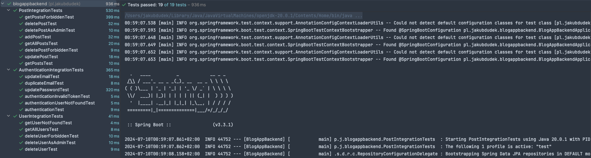

# BlogAppBackend
Backend for personal blog app, written in Spring Boot. Currently in development.


## Tech Stack
- Spring Boot
- Spring Security
- JWT
- BCrypt
- Hibernate


## Endpoints
### POST: /api/auth/log-in
```json
{
  "email": "example@gmail.com",
  "password": "12345678"
}
```

### GET: /api/auth/log-out
- Log out by removing HTTP-only cookies
- Requires authentication

### GET: /api/auth
- Get logged-in user data
- Requires authentication

### PUT: /api/auth/email
```json
{
  "email": "new.email@gmail.com"
}
```
- Requires authentication

### PUT: /api/auth/password
```json
{
  "currentPassword": "12345678",
  "newPassword": "new-password"
}
```
- Requires authentication

### GET: /api/users/:id
- Get chosen user by id

### GET: /api/users
- Get all users

### PUT: /api/users/:id
```json
{
  "name": "New Username"
}
```
- Requires authentication
- User can edit only own
- Admin can edit any

### PUT: /api/users/:id/profile-image
- multipart/form-data, *image* key
- Edit chosen user's profile image
- Requires authentication
- User can edit only own
- Admin can edit any

### DELETE: /api/users/:id/delete-user
- Requires authentication
- User can delete only his own account
- Admin can delete any account

### POST: /api/posts
```json
{
  "title": "Example title",
  "body": "Example long text",
  "status": "DRAFT or PUBLISHED"
}
```
- Requires authentication

### GET: /api/posts
- Get all published posts

### GET: /api/posts/all
- Get all posts
- Requires authentication
- Requires admin role

### GET: /api/posts/:id
- Get chosen post by id

### PUT: /api/posts/:id
```json
{
  "title": "New title",
  "body": "New text",
  "status": "DRAFT or PUBLISHED"
}
```
- Requires authentication
- Only author or admin can update

### DELETE: /api/posts/:id
- Delete chosen post by id
- Requires authentication
- Only author or admin can delete

### GET: /api/files/download/:name
- Download chosen file by its name


## Integration tests
  